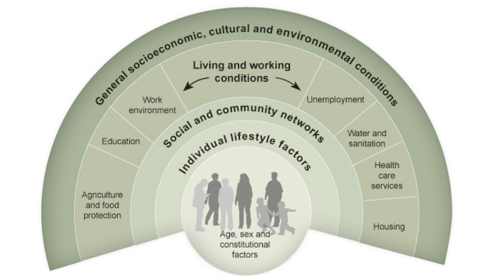
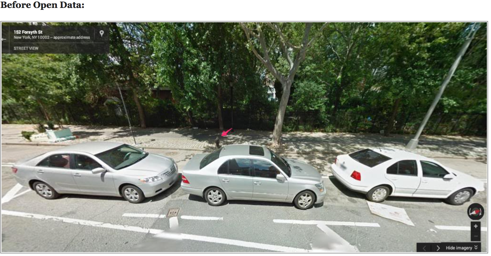
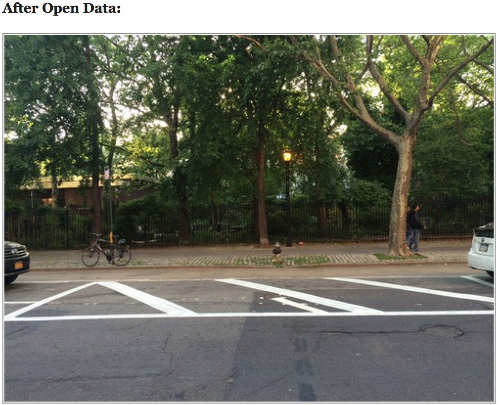
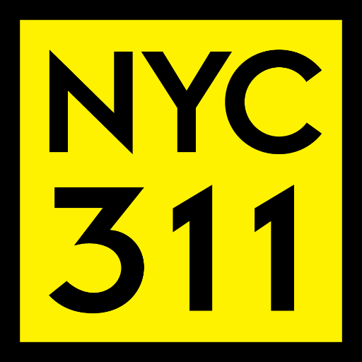
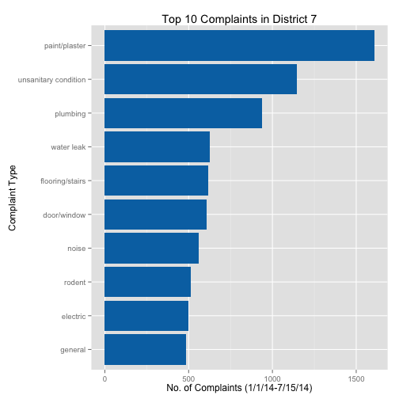
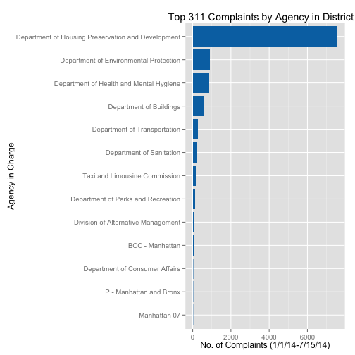
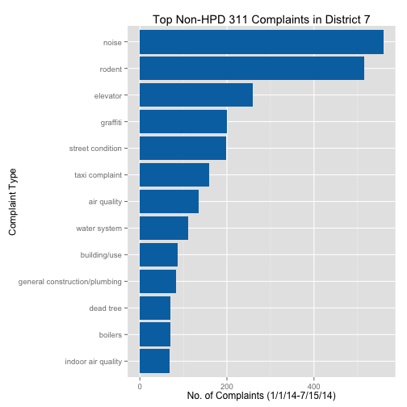
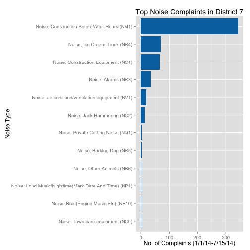
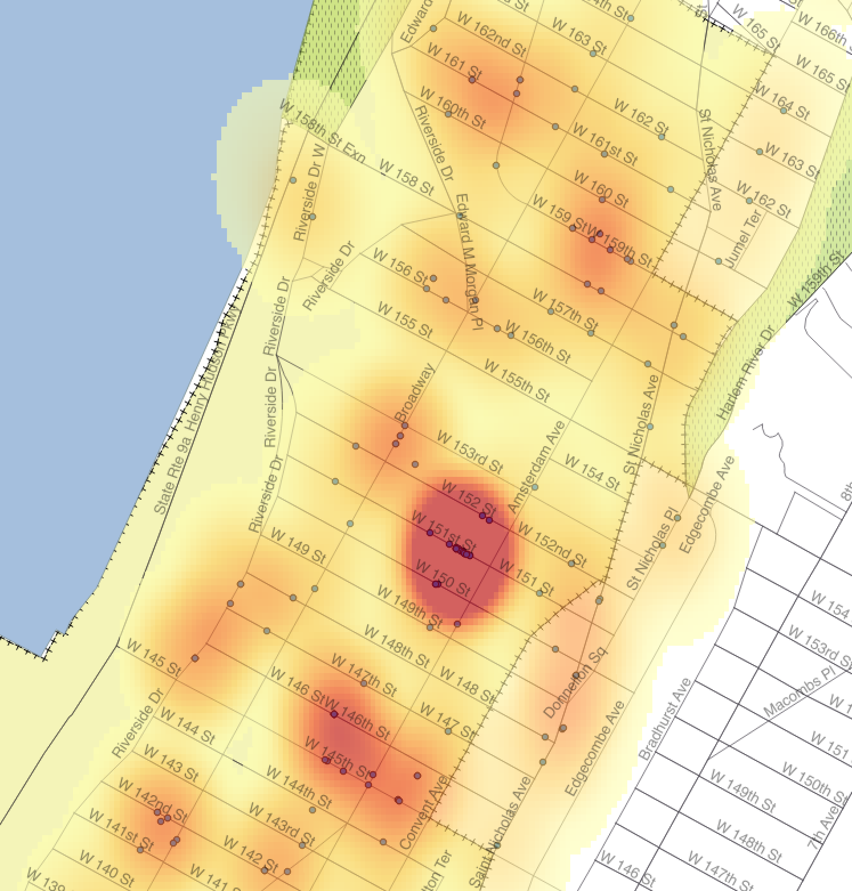

## Challenges

    

- Overemphasis of the **analysis** and **reflection** phases
- Underemphasis of the **preparation** and **dissemination** phases
- Problem spaces may have no data to begin with
- Insights have few outlets to actualize into action

---
## Community-Level Change

- How can we use Open Data to inform change at the local level?

- What are some avenues for turning insight into action?

    

---
## Motivating Example

 

The story of how a visiting faculty member at the Pratt School of Architecture with a penchant for civic improvement saved New Yorkers over $55,000 a year in parking tickets.

- Parking Tickets via [NYC Open Data](https://data.cityofnewyork.us/Transportation/Parking-Tickets/yyiw-ypks)

- Ben Wellington, [IQuantNY](http://iquantny.tumblr.com/)

- [Reddit, Tumblr, and Local Media Outlets]((http://iquantny.tumblr.com/post/87573867759/success-how-nyc-open-data-and-reddit-saved-new-yorkers))

    

---
## Motivating Example

    

---
## Motivating Example

    

---
## Innovations

One person can instigate change at the community level and resolve unintended policy side-effects:

- Open Government Initiatives
    - Encourages public oversight
    - Enables creative solutions from civically minded individuals
    
- Basic Exploratory Data Analysis
    - Outliers can reveal an interesting story
    - Descriptive statistics can inform future research
    
- Social Media
    - Disseminate findings to larger audiences
    - Generate public discussion

---
## NYC 311 Service Requests

 

    
    

 

<a href = 'https://nycopendata.socrata.com/Social-Services/311-Service-Requests-from-2010-to-Present/erm2-nwe9'> Service Request Data from 2010 to Present</a>

---
## Top 10 Complaints

---
## Top Agency Complaints

---
## Top Non-HPD Complaints

---
## Top Noise Complaints

---
## 311 Rat Complaints

<iframe src="https://ryancquan.cartodb.com/viz/0402041a-2189-11e4-bae6-0e73339ffa50/embed_map" height="75" width="200"></iframe> 

[Dynamic Version](https://ryancquan.cartodb.com/viz/23cfbfc6-0f96-11e4-88e0-0e10bcd91c2b/embed_map)

---
## 311 Rat Complaints

Using [QGIS](http://www.qgis.com/), an open-source GIS software, we can run a points-in-polygon analysis and identify clusters of complaints inside our district of interest. 

Here we identified a building on 151st between Amsterdam and Broadway with several open rat complaint cases from different callers:

    

---
## Methods

- Pull, wrangle, and visualize open data using open-source software

- Time-series analysis to observe monthly trends

- Qualitatively-driven
    - Ex: Supporting rat anecdotes with 311 complaint data
    
- Quantitatively-driven
    - Ex: Supporting pothole data with pictures from on-site visits

- Submitting evidence to respective government agencies for quick-fixes

---
## Other Examples

- Holding NYC Council Accountable | [Blog](http://www.ryancquan.com/blog/2014/9/11/new-york-city-council-meetings-annual-trends) | [Rpubs](http://rpubs.com/rcquan/nycc-meetings)

- NYPD Motor Vehicle Collisions | [Data](https://data.cityofnewyork.us/NYC-BigApps/NYPD-Motor-Vehicle-Collisions/h9gi-nx95)

- New York State Medical Misconduct Cases | [Data](https://health.data.ny.gov/Health/Professional-Medical-Conduct-Board-Actions-Beginni/ebmi-8ctw) | [GitHub](https://github.com/fryandata/medicalmisconduct)

- BanTheBins | [Usahidi Crowdmap (Prototype)](https://banthebins.crowdmap.com/)

---
## Benefits of Open Data

- Reproducibility of Analysis

- Motivates "neighborhood-specific" research

- Encourages collaboration and new developments

- Removes barriers to civic engagement

## Downsides to Open Data

- Potential for abuse

- Quality of data sources

- Difficult to go beyond correlational studies

---
## Resources

- Software
    - Statistical Analysis | [R](http://www.r-project.org/)
    - Data Visualization | [ggplot2](http://ggplot2.org/)
    - GIS - [QGIS](http://www.qgis.com/) | [CartoDB](http://cartodb.com/)
    - Data Munging | [Python/pandas](http://pandas.pydata.org/)
    
- Blogs
    - NYC Open Data Analysis | [IQuantNY](http://iquantny.tumblr.com/)
    - Story-telling with Data | [FryanData](http://fryandata.wordpress.com/)
    
- Datasets
    - [Data.gov](https://www.data.gov/)
    - [NYC OpenData](https://nycopendata.socrata.com/)
    - [Open New York](https://data.ny.gov/)

---
## Reproducibility

- 311 Data Report for District 7 | [Rpubs](http://rpubs.com/rcquan/22480)
- R Code - [GitHub](www.github.com/rcquan)
- HTML5 Slides - [GitHub](www.github.com/rcquan)

---
## Thanks!

---
